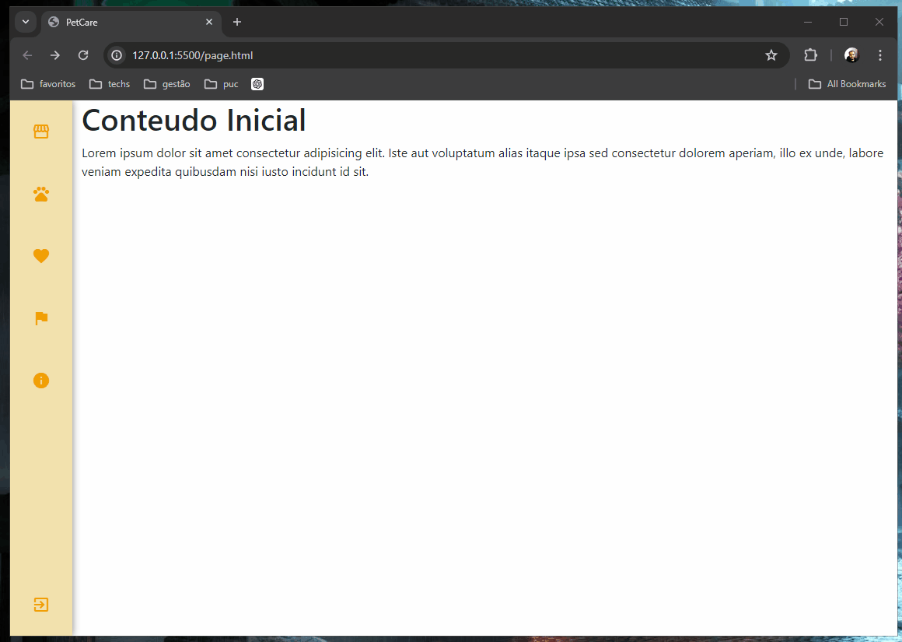

### Intruções para inclusão de paginas novas:

- Alterar página "page.html" ou as paginas de exemplo e renomeá-las como necessário;

- Para ter as cores do tema no seu CSS, incluir o arquivo abaixo no seu estilo css;

  ```css
  @import url('/src/css/petcare_colors_style.css');
  ```

- incluir o conteúdo na seção indicada no arquivo page.html:

  ```html
              <div class="col content">
  
                  <!-- Conteúdos das páginas -->
  
                  <h1>Conteudo Inicial</h1>
                  <p>Lorem ipsum dolor sit amet consectetur adipisicing elit. Iste aut voluptatum alias itaque ipsa sed
                      consectetur dolorem aperiam, illo ex unde, labore veniam expedita quibusdam nisi iusto incidunt id
                      sit.</p>
  
              </div>
  ```

- adicionar os links necessários nos menus;

### Funcionamento atual:

